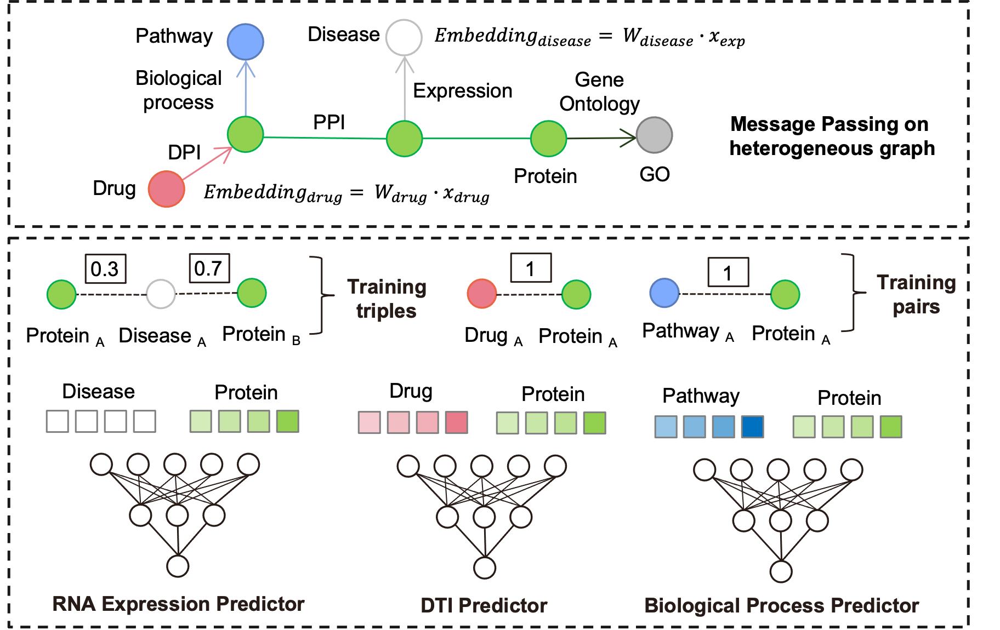

 # KGDDP-biomarker
## KG-enhanced Disease Diagnosis Predictor
KGDDP-biomarker is a sophisticated machine learning model that utilizes knowledge graphs (KG) to enhance disease diagnosis prediction. By integrating biomarker information with multi-modal data, this tool aims to provide more accurate and insightful disease diagnosis.

### Table of Contents
- [Features](#features)
- [Installation](#installation)
- [Usage](#usage)
- [Data](#data)
- [Model Architecture](#model-architecture)

### Features
- We introduce the computational framework of KGDDP that integrates deep learning with a knowledge graph to facilitate biomarker identification.
- KGDDP provides validated and novel biomarkers for distinguish IBD patients.
- A two-step model based biomarker combinations classify IBD patients with its subtypes.
- KGDDP enhanced interpretability enables the potential mechanisms of biomarkers in IBD.

### Installation
To reproduce the results of this project, please follow the steps below:
- Python == 3.6
- conda create -n KGDDP python=3.6
- pip install -r requirements.txt
- **Noted:**  To implement heterogeneous message passing, replace the hetero.py file located at ./anaconda3/envs/env_name/lib/python3.6/site-packages/dgl/nn/pytorch/hetero.py with the version provided.

### Usage
python hyper_model.py

### Data
The KGDDP-biomarker project utilizes mutli-modal data to build and evaluate the disease diagnosis prediction model.
- Due to file size limitations, the dataset is hosted externally. 
- You can download it from the following link: https://doi.org/10.5281/zenodo.13920084 

 Click to expand for detailed description of each dataset used in the project

1. **Knowledge Graph Data** (`kg`):
   - **File**: `kg_del_selfloop.csv`
   - **Description**: This dataset contains the knowledge graph data that represents relationships between biological entities, including drugs, proteins, and diseases. It is crucial for understanding the interconnections and enhancing the predictive capabilities of the model.

2. **Negative Pathway-Protein Relationships** (`pro_path_neg_sp`):
   - **File**: `human_neg_pathpro.csv`
   - **Description**: This dataset provides information about negative relationships between pathways and proteins. 

3. **Negative Drug-Protein Interactions** (`dpi_neg`):
   - **File**: `neg_dpi_df_t10.csv`
   - **Description**: This dataset includes negative interactions between drug and proteins.

4. **Feature Profiles** (`fp_df`):
   - **File**: `bdki_db_gdsc_fp.csv`
   - **Description**: This dataset contains molecular fingerprints of drugs, which are used to train the model.

5. **Expression Triples** (`exp_triples`):
   - **File**: `exp_triples.csv`
   - **Description**: This dataset consists of expression triples representing relationships between genes and their expression levels.

6. **Expression Graph Triples** (`exp_triples_graph`):
   - **File**: `exp_graph_triples.csv`
   - **Description**: This dataset contains graph triples that depict relationships within the expression data. It is used to construct a graph representation of the data, which is essential for graph-based analysis techniques.

7. **Expression Input Data** (`exp_input`):
   - **File**: `se_exp_input.csv`
   - **Description**: This dataset serves as the input for the expression data model, containing necessary information to perform predictions based on gene expression levels.

8. **Sample Information** (`dls`):
   - **File**: `sample_info.csv`
   - **Description**: This dataset includes sample information. 

### Model Architecture

The KGDDP (Knowledge Graph Enhanced Disease Diagnosis Predictor) model is a deep learning architecture designed to leverage heterogeneous graph data for disease diagnosis prediction. The model integrates various types of biological interactions using graph neural networks. Click to expand for the key components of the model:

1. **Input Features**:
   - **`in_feats`**: Input feature size, representing the dimensionality of the feature vectors for the nodes in the graph.
   - **`hid_feats`**: Hidden feature size, representing the dimensionality of the hidden layers in the model.
   - **`pid_fea_sc`**, **`drug_fea`**: Preprocessed feature embeddings for proteins and drugs, respectively.
   - **`pro_entity_df`**, **`pathway_entity_df`**, **`go_entity_df`**: DataFrames containing entities related to proteins, pathways, and Gene Ontology (GO) terms.

2. **Graph Convolution Layers**:
   - **`HeteroGraphConv`**: This layer performs message passing for heterogeneous graphs. It utilizes multiple types of convolutional layers:
     - **`SAGEConv`**: Used for the relationships among proteins, pathways, and diseases, aggregating features from neighbor nodes to produce new representations.
     - **`GraphConv`**: Specifically applied for the pathway-protein interactions, allowing for normalization and weighted updates of features.

3. **Embedding Layers**:
   - **`nn.Embedding`**: Used to create learnable embeddings for the protein, pathway, and GO entities. This allows the model to learn representations for these entities that capture their relationships within the knowledge graph.

4. **Linear Layers**:
   - **`W_in_drug`** and **`W_in_pid`**: Linear transformation layers that project the drug and protein input features into the input feature space for further processing.
   - **`mlp_decoder`**: A multi-layer perceptron that takes concatenated features of head and tail nodes and outputs a score representing the likelihood of interaction.

5. **Classifier Layers**:
   - **`classifier_d`**: A sequential neural network that classifies the relationships into three categories based on the input features. It consists of a linear layer followed by a ReLU activation and another linear layer.

6. **Forward Pass**:
   The `forward` method of the `KGDDP` model implements the computation for the prediction process:
   - Node features are initialized from embeddings and input features.
   - The first graph convolution layer (`conv1`) processes the input graph `g` with the initial node features.
   - The second graph convolution layer (`conv2`) refines the features based on the updated node representations.
   - Scores for interactions are calculated using the `mlp_decoder` by concatenating head and tail features for both positive and negative predictions.
   - The model outputs differences in scores for head-tail pairs, providing a measure of how likely they are to be linked.

